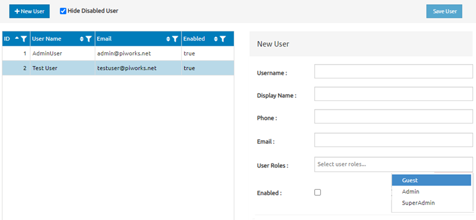

# User Management Screen

This document is a user specification outline for the user management screen below:

This screen is used by administrators to manage the users of the application.

<!-- Requirements -->
## Requirements 

The user management screen should allow administrators to perform the following tasks:

  <ol>
    <li>
     View a list of all users
      <ul>
        <li>Users can be viewed and sorted based on: ID, User Name, Email, or Enabled functionality</li>
      </ul>
            <ul>
        <li>Hide disabled users</li>
      </ul>
    </li> 
  <li>
  Create new user
  <ul>
  <li> Fill the user's information: username, display name, phone number, user email, user role</li>
  </ul>
    <ul> 
  <li> Enable or disable user</li>
  </ul>  

  <li>
  Edit the data of existing users
    <ul>
    <li> Edit user name</li>
    </ul>
      <ul>
    <li> Edit user email</li>
    </ul>
      <ul>
    <li> Enable/Disable user</li>
    </ul>
      <ul>
    <li> Edit user display name</li>
    </ul>
      <ul>
    <li> Edit user phone number</li>
    </ul>
      <ul>
    <li> Edit user roles</li>
    </ul>  
  
   <li>
  Assign roles to user
  <ul>
  <li>Assign Guest</li>
  </ul>
    <ul>
  <li>Assign Admin</li>
  </ul>
    <ul>
  <li>Assign SuperAdmin</li>
  </ul>  
  
 <li>
  Save user
  <ul>
  <li>Save the user's data in the system's database</li>
  </ul>

  
  
  
  
  
  
  
  
  
  
  
  
  
  
  

   
 

    
    <li><a href="#usage">Usage</a></li>
    <li><a href="#roadmap">Roadmap</a></li>
    <li><a href="#contributing">Contributing</a></li>
    <li><a href="#license">License</a></li>
    <li><a href="#contact">Contact</a></li>
    <li><a href="#acknowledgments">Acknowledgments</a></li>
  </ol>

* Change user status to either Enabled or Disabled user.
** their emails, and whether or not the user is enabled or disabled.
*	Create a new user.
*	Edit an existing user.
*	Delete a user.
* Search for users by name or email address.

UI Components
The user management screen should contain the following UI components:
User List
The user list should display a table of all users, showing their name, email address, and role. Each row should also have buttons for editing and deleting the user.
Create/Edit User Form
The create/edit user form should contain the following fields:
•	First name (required)
•	Last name (required)
•	Email address (required, unique)
•	Password (required)
•	Role (required)
Search Bar
The search bar should allow administrators to search for users by name or email address.
Page Behavior
User List
When the page loads, the user list should display all users in the system. Administrators can click on the edit button to edit a user or the delete button to delete a user. When an administrator clicks the edit button, the create/edit user form should be displayed with the selected user's information pre-populated.
Create/Edit User Form
When the create/edit user form is displayed, the administrator can enter the user's information into the form fields. The administrator must fill out all required fields before submitting the form. If the email address entered is not unique, an error message should be displayed, and the form should not be submitted. If the form is successfully submitted, the user list should be updated with the new user or the edited user's information.
Search Bar
The search bar should allow administrators to search for users by name or email address. As the administrator types into the search bar, the user list should update to show only the users that match the search criteria.
Initial Display
When the user management screen is first displayed, the user list should show all users in the system. The create/edit user form and search bar should be hidden.
